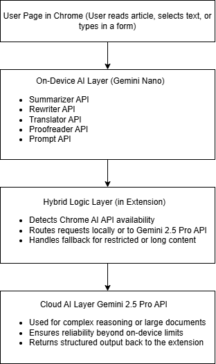

# PageClarity - AI Reading Assistant for Chrome

**Learn, Simplify, Translate: Without Leaving the Page**

PageClarity is a Chrome extension that enhances your web browsing experience with AI-powered reading assistance. Get instant summaries, simplify complex text, translate content, proofread writing, and ask questions about any webpage, all without leaving your current tab.

## Table of Contents

- [Demo Video](#demo-video)
- [Features](#features)
- [AI Technology](#ai-technology)
- [Architecture Diagram](#architecture-diagram)
- [Quick Start](#quick-start)
- [How to Use](#how-to-use)
- [Installation](#installation)
- [Configuration](#configuration)
- [Testing](#testing)
- [Project Structure](#project-structure)
- [Privacy & Security](#privacy--security)
- [Contributing](#contributing)
- [License](#license)

## Demo Video

**Public Access Link to the Demo Video (YouTube Link):**
https://youtu.be/vhSsu7vCxQY

<video controls src="https://private-user-images.githubusercontent.com/97367319/508505843-392276cd-40b2-46b1-b9c9-fd955056884e.mp4?jwt=eyJ0eXAiOiJKV1QiLCJhbGciOiJIUzI1NiJ9.eyJpc3MiOiJnaXRodWIuY29tIiwiYXVkIjoicmF3LmdpdGh1YnVzZXJjb250ZW50LmNvbSIsImtleSI6ImtleTUiLCJleHAiOjE3NjE5NjYyNTUsIm5iZiI6MTc2MTk2NTk1NSwicGF0aCI6Ii85NzM2NzMxOS81MDg1MDU4NDMtMzkyMjc2Y2QtNDBiMi00NmIxLWI5YzktZmQ5NTUwNTY4ODRlLm1wND9YLUFtei1BbGdvcml0aG09QVdTNC1ITUFDLVNIQTI1NiZYLUFtei1DcmVkZW50aWFsPUFLSUFWQ09EWUxTQTUzUFFLNFpBJTJGMjAyNTExMDElMkZ1cy1lYXN0LTElMkZzMyUyRmF3czRfcmVxdWVzdCZYLUFtei1EYXRlPTIwMjUxMTAxVDAyNTkxNVomWC1BbXotRXhwaXJlcz0zMDAmWC1BbXotU2lnbmF0dXJlPTQxYzM1ODcxZTdhYTdlMWY1N2JiZTNjYzZjMjVkYjk1MmY4ZDE1MDI4YTdiYjIxYWIxYjFiOTg0NGY0N2FkYzQmWC1BbXotU2lnbmVkSGVhZGVycz1ob3N0In0.jTE9aRhN0uyGK1k5XWuDke9el6ZBxzIW9JFt2ee1EZc" title="PageClarity Demo Video - AI Reading Assistant">
</video>

*3-minute walkthrough showing four-tier hybrid AI architecture, Chrome AI integration, Gemini 2.5 Pro fallback, and all five AI features in action.*

## Features

- **Smart Summarization**: Get concise summaries of entire pages or selected text
- **Text Simplification**: Rewrite complex text in plain English, friendly tone, or shorter format
- **Multi-language Translation**: Translate selected text into 6+ languages (Spanish, French, German, Hindi, Chinese, Japanese)
- **Grammar & Spell Check**: Proofread and correct writing errors instantly
- **Intelligent Q&A**: Ask natural language questions about webpage content
- **Rich Text Copying**: Copy results with formatting preserved (bold, italic, bullets)
- **Security-First**: Graceful fallbacks for secure sites with content restrictions

## AI Technology

### Hybrid AI Architecture

PageClarity uses a **four-tier hybrid AI approach** for maximum reliability and functionality:

1. **Chrome AI First** (Preferred)
   - Uses Chrome's built-in AI (Gemini Nano)
   - 100% on-device processing
   - Private and fast
   - No internet required

2. **Smart Routing Layer** (Intelligence)
   - Automatically switches between AI providers
   - Handles API availability and errors
   - Ensures seamless user experience
   - Optimizes for speed and reliability

3. **Gemini API Fallback** (Cloud-based)
   - Google's **Gemini 2.5 Pro** model via Generative Language API
   - Always available with internet connection
   - Real AI functionality for immediate use
   - Free tier: 15 requests/minute

4. **Demo Mode** (Development)
   - Placeholder responses for testing
   - Works without any API configuration
   - Helps developers understand functionality

### Chrome AI APIs Utilized

- **Summarizer API**: Page and text summarization
- **Rewriter API**: Text simplification and style changes  
- **Translator API**: Multi-language translation
- **Proofreader API**: Grammar and spelling correction
- **Prompt API**: Q&A and contextual queries

**Important**: Chrome AI APIs are currently in **Early Preview** (2025) and require Chrome Canary/Dev with special flags enabled and specific device compatibility. The APIs have moved from the deprecated `window.ai` namespace to `self.ai`. **PageClarity uses Gemini 2.5 Pro as the primary AI provider** to ensure reliable functionality for all users.

## Architecture Diagram



*Built on a four-layer hybrid system, PageClarity seamlessly integrates with any webpage. Chrome's built-in AI provides on-device privacy through five specialized APIs: Summarizer, Rewriter, Translator, Proofreader, and Prompt. The intelligent routing layer automatically switches between local Chrome AI and cloud-based Gemini 2.5 Pro, ensuring optimal performance and reliability. This architecture makes PageClarity future-ready for Chrome's evolving AI capabilities while maintaining backward compatibility and graceful fallbacks.*

## Quick Start

1. **Download the extension**:
   ```bash
   git clone https://github.com/yourusername/pageclarity.git
   cd pageclarity
   ```

2. **Set up API key** (for real AI functionality):
   - Copy the configuration template:
   ```bash
   cp src/config.example.js src/config.js
   ```
   - Open `src/config.js` in any text editor and add your Gemini API key

3. **Load in Chrome**:
   - Open `chrome://extensions/`
   - Enable "Developer mode" (toggle in top-right)
   - Click "Load unpacked" → select the `pageclarity` folder

4. **Start using**: Click the PageClarity icon on any webpage!

## How to Use

### Basic Workflow
1. **Navigate** to any webpage
2. **Click** the PageClarity extension icon in your toolbar
3. **Select** the feature you need from the 5 tabs
4. **Copy** results to clipboard with preserved formatting

### Feature-Specific Usage

**Summarization**
- Click "Summarize page" for full page summary
- Select text → "Summarize selection" for specific content

**Simplification** 
- Select complex text
- Choose style: Plain English, Friendly, or Shorter
- Click "Rewrite selection"

**Translation**
- Select text in any language
- Choose target language from dropdown
- Click "Translate selection"

**Proofreading**
- Select text with potential errors
- Click "Proofread selected input"
- View original vs. corrected versions

**Q&A**
- Type your question about the page
- Click "Ask" for AI-generated answers
- Works with page context and selected text

## Installation

### Prerequisites
- Google Chrome (latest version recommended)
- For Chrome AI: Chrome Canary/Dev with AI Early Preview enabled

### Step-by-Step Installation

1. **Download the extension**:
   ```bash
   git clone https://github.com/yourusername/pageclarity.git
   cd pageclarity
   ```

2. **Open Chrome Extensions page**:
   - Navigate to `chrome://extensions/`
   - Toggle "Developer mode" ON (top-right corner)

3. **Load the extension**:
   - Click "Load unpacked"
   - Select the `pageclarity` folder
   - Extension icon appears in toolbar

4. **Verify installation**:
   - Click the PageClarity icon
   - You should see the popup with 5 tabs

## Configuration

### API Key Setup (Recommended)

For full AI functionality, configure the Gemini API:

1. **Get free API key**:
   - Visit [Google AI Studio](https://aistudio.google.com/app/apikey)
   - Sign in with Google account
   - Click "Create API Key"
   - Copy the generated key

2. **Configure the extension** (update API key in both files):
   - Copy the configuration template:
   ```bash
   cp src/config.example.js src/config.js
   ```
   - Open `src/config.js` in any text editor (Notepad, VS Code, etc.)
   - Replace `YOUR_GEMINI_API_KEY_HERE` with your actual API key:
   ```javascript
   const GEMINI_API_KEY = 'your-actual-api-key-here';
   ```
   
   - **Also update popup.js**:
   - Open `src/popup.js` in any text editor
   - Find line 4: `const GEMINI_API_KEY = 'YOUR_GEMINI_API_KEY_HERE';`
   - Replace `YOUR_GEMINI_API_KEY_HERE` with your actual API key

3. **Reload extension**:
   - Go to `chrome://extensions/`
   - Click reload button on PageClarity
   - Test on any webpage

### Chrome AI Setup (Future)

For on-device AI processing:
- Install Chrome Canary or Dev channel
- Enable Chrome AI Early Preview features
- Origin trial tokens (when available)

See [SETUP.md](SETUP.md) for detailed configuration instructions.

## Testing

Use the included [demo.html](demo.html) file to test all features:

### Test Scenarios

**Summarization Testing**
- Open demo.html → test with long article content
- Try both "Summarize page" and "Summarize selection"

**Simplification Testing**
- Select the complex quantum computing paragraph
- Test different styles: Plain, Friendly, Shorter

**Translation Testing**
- Select the welcome message
- Try different target languages

**Proofreading Testing**
- Use the textarea with intentional errors
- Test grammar and spelling corrections

**Q&A Testing**
- Ask questions like:
  - "What is this page about?"
  - "How many test sections are there?"
  - "What should I test first?"

### Expected Responses

After proper setup, you should see:
- `[Chrome AI] ...` (when Chrome AI available - requires Chrome Canary + flags)
- `[Gemini API] ...` (normal operation - Gemini 2.5 Pro model)
- `[DEMO MODE] ...` (when no API configured)

**Seeing `[Gemini API]` responses is normal and expected** - Chrome AI APIs are still in Early Preview and require specific setup. This demonstrates your extension is working perfectly with real AI functionality.

## Project Structure

```
pageclarity/
├── manifest.json              # Extension manifest (Manifest V3)
├── src/
│   ├── popup.html            # Main UI interface
│   ├── popup.js              # UI logic and event handlers
│   ├── popup.css             # Modern Google-style styling
│   ├── content.js            # Page interaction script
│   ├── service_worker.js     # Background service worker
│   ├── config.example.js     # API key configuration template
│   └── ai/                   # AI API wrapper modules
│       ├── summarize.js      # Summarizer API wrapper
│       ├── rewrite.js        # Rewriter API wrapper
│       ├── translate.js      # Translator API wrapper
│       ├── proofread.js      # Proofreader API wrapper
│       └── prompt.js         # Prompt API wrapper
├── assets/
│   ├── icon16.png           # Extension icons (16x16)
│   ├── icon48.png           # Extension icons (48x48)
│   └── icon128.png          # Extension icons (128x128)
├── demo.html                 # Feature testing page
├── README.md                 # This file
├── SETUP.md                  # Detailed setup instructions
├── LICENSE                   # MIT License
└── .gitignore               # Git ignore rules
```

## Privacy & Security

### Data Protection
- **Local Processing**: Chrome AI runs entirely on-device
- **No Tracking**: Extension doesn't collect personal information
- **Secure Fallbacks**: Graceful handling of restricted sites
- **Content Security**: Respects website security policies

### API Usage
- **Gemini API**: Only used when Chrome AI unavailable
- **Minimal Data**: Only selected text sent to cloud APIs
- **No Storage**: No persistent data storage
- **User Control**: Users choose what text to process

### Security Features
- Content Security Policy compliance
- Secure messaging between components
- Permission-based access to webpage content
- Fallback prompts for restricted sites

## Contributing

We welcome contributions! Here's how to get started:

1. **Fork the repository**
2. **Create a feature branch**:
   ```bash
   git checkout -b feature/amazing-feature
   ```
3. **Make your changes**
4. **Test thoroughly** with Chrome AI APIs
5. **Submit a pull request**

### Development Guidelines
- Follow existing code style
- Test on multiple websites
- Ensure Chrome AI compatibility
- Update documentation as needed

## License

MIT License - see [LICENSE](LICENSE) file for details.

Copyright (c) 2025 Sharon Van

---

**Built for the Google Chrome Built-in AI Challenge 2025**

PageClarity demonstrates the power of hybrid AI processing, combining Chrome's built-in capabilities with cloud-based fallbacks to create a seamless, accessible reading assistance tool for all users.

**Targeting Prize Categories:**
- Best Hybrid AI Implementation
- Most Practical Application
- Best User Experience

---

*Made with care for better web accessibility and AI-powered reading assistance.*